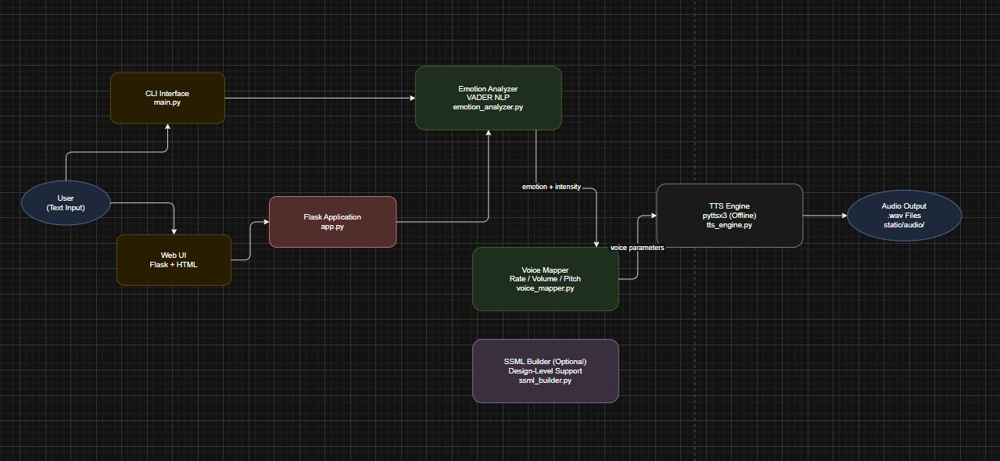

# The Empathy Engine

Emotion-aware text-to-speech for more human, expressive AI voice output.

## Project Summary

The Empathy Engine is a Python-based service that accepts input text, detects the emotion expressed in that text, maps the detected emotion to vocal parameters, and generates a playable `.wav` file.

This project was built for the challenge:

`Challenge 1: The Empathy Engine: Giving AI a Human Voice`

The goal is to move beyond flat, robotic TTS output and make AI voices sound more natural, responsive, and emotionally aware.

## What The Project Does

Given a line of text, the system:

1. Accepts text from either the CLI or a web interface.
2. Detects emotion using a lightweight and explainable sentiment pipeline.
3. Computes emotion intensity.
4. Maps emotion and intensity to voice settings such as rate, volume, and pitch.
5. Generates a `.wav` audio file using offline text-to-speech.

## Challenge Requirements Coverage

This submission satisfies the core requirements from the prompt:

- `Text Input`: supported through both CLI (`main.py`) and Web UI (`app.py`)
- `Emotion Detection`: classifies text into multiple emotion categories
- `Vocal Parameter Modulation`: alters rate, volume, and pitch
- `Emotion-to-Voice Mapping`: uses explicit rule-based mapping logic
- `Audio Output`: generates playable `.wav` files in `static/audio/`

It also includes several bonus features:

- `Granular emotions`: positive, negative, neutral, enthusiastic, frustrated, inquisitive
- `Intensity scaling`: stronger sentiment changes vocal parameters more strongly
- `Web interface`: Flask app with browser input and audio playback
- `SSML support`: design-level SSML builder included for future upgrades

## Emotion Categories

The system currently supports these output classes:

- `neutral`
- `positive`
- `negative`
- `enthusiastic`
- `frustrated`
- `inquisitive`

## High-Level Architecture

The processing flow is:

`Text Input -> Emotion Detection -> Intensity Calculation -> Voice Mapping -> TTS Generation -> WAV Output`

### Modules

- [app.py](C:/Users/AtomOne/Desktop/TEJA/app.py:1): Flask web entry point
- [main.py](C:/Users/AtomOne/Desktop/TEJA/main.py:1): CLI entry point
- [src/emotion_analyzer.py](C:/Users/AtomOne/Desktop/TEJA/src/emotion_analyzer.py:1): emotion classification logic
- [src/voice_mapper.py](C:/Users/AtomOne/Desktop/TEJA/src/voice_mapper.py:1): maps emotions to speech parameters
- [src/tts_engine.py](C:/Users/AtomOne/Desktop/TEJA/src/tts_engine.py:1): audio generation
- [src/ssml_builder.py](C:/Users/AtomOne/Desktop/TEJA/src/ssml_builder.py:1): optional SSML-oriented design extension

## Tech Stack

- `Python`
- `Flask`
- `VADER Sentiment Analyzer`
- `pyttsx3`
- `HTML/Jinja2`

## Design Choices

### Why VADER

VADER was chosen because it is:

- lightweight
- fast
- explainable
- suitable for short conversational inputs

This keeps the system simple, offline, and easy to debug during demos.

### Why pyttsx3

`pyttsx3` allows offline speech generation without requiring paid APIs or network access. That makes the project easy to run locally and ideal for a hackathon or prototype setting.

### Why Rule-Based Mapping

The challenge specifically benefits from transparent mapping between text emotion and vocal behavior. Instead of using a black-box audio model, this project uses rules that are easy to inspect, explain, and tune.

## Emotion Detection Logic

Emotion detection is implemented in [src/emotion_analyzer.py](C:/Users/AtomOne/Desktop/TEJA/src/emotion_analyzer.py:1).

The system combines:

- VADER compound sentiment score in the range `-1.0` to `+1.0`
- simple heuristics based on punctuation and thresholds

### Current Rules

- If sentiment is strongly positive or the text contains `!`, classify as `enthusiastic`
- If sentiment is strongly negative, classify as `frustrated`
- If the text contains `?`, classify as `inquisitive`
- If sentiment is mildly positive, classify as `positive`
- If sentiment is mildly negative, classify as `negative`
- Otherwise, classify as `neutral`

## Emotion-to-Voice Mapping

Voice mapping is implemented in [src/voice_mapper.py](C:/Users/AtomOne/Desktop/TEJA/src/voice_mapper.py:1).

### Baseline Settings

- `Rate`: `150`
- `Volume`: `0.9`
- `Pitch`: `50`

### Mapping Strategy

- `positive` and `enthusiastic`
  - faster speech
  - slightly louder output
  - higher pitch
- `negative` and `frustrated`
  - slower speech
  - softer output
  - lower pitch
- `inquisitive`
  - slightly faster rate
  - near-baseline volume
  - slightly higher pitch
- `neutral`
  - baseline settings

### Intensity Scaling

The absolute value of the sentiment intensity controls how strongly the voice settings are changed.

Examples:

- `This is good.` produces a modest positive modulation
- `This is the best news ever!` produces stronger positive modulation
- `I am disappointed.` produces negative modulation
- `Why is this taking so long?` produces inquisitive or frustrated behavior depending on sentiment

## Web Interface

The Flask web app provides:

- a text input area
- emotion detection feedback
- displayed intensity value
- generated audio playback in the browser

Run the app and open:

`http://127.0.0.1:5000`

## Architecture Diagram



## Setup Instructions

### 1. Clone the Repository

```bash
git clone https://github.com/Tej1324/Empathy-Engine.git
cd Empathy-Engine
```

### 2. Create a Virtual Environment

Windows PowerShell:

```powershell
python -m venv .venv
.venv\Scripts\Activate.ps1
```

### 3. Install Dependencies

```powershell
pip install -r requirements.txt
```

### 4. Run the Application

#### Option A: CLI Mode

```powershell
python main.py
```

You will be prompted to enter text, and the generated `.wav` file will be saved locally.

#### Option B: Web Interface

```powershell
python app.py
```

Then visit:

`http://127.0.0.1:5000`

## Output Location

Generated audio files are written to:

`static/audio/`

Examples:

- `static/audio/output_positive_<timestamp>.wav`
- `static/audio/output_enthusiastic_<timestamp>.wav`

## Example Inputs

- `This is AMAZING news!`
- `Your request has been processed successfully.`
- `I am disappointed with the service.`
- `Why is this taking so long?`
- `The meeting is at 4 PM.`

## Notes On Runtime Behavior

- The application is designed to run locally and offline.
- Pitch support depends on the Windows TTS backend and may be best-effort on some systems.
- On Windows, generated audio uses the system speech engine available to `pyttsx3`.

## Limitations

- Rule-based emotion detection may miss sarcasm, mixed emotions, or subtle context.
- TTS quality depends on the voices installed on the host system.
- Pitch control is limited by the capabilities of the underlying speech engine.

## Future Improvements

- use transformer-based emotion classification
- support more nuanced states such as concern, surprise, or empathy
- add advanced SSML execution with a richer TTS backend
- support multilingual speech generation
- provide a REST API endpoint for external integrations

## Repository Deliverable

GitHub repository:

`https://github.com/Tej1324/Empathy-Engine`

This repository contains:

- complete runnable source code
- setup and run instructions
- explanation of design choices
- explicit emotion-to-voice mapping logic

## Conclusion

The Empathy Engine demonstrates how sentiment-aware speech can be built with lightweight, explainable components. It takes text, detects emotional tone, modulates voice behavior, and produces expressive audio output that feels more human than standard monotone TTS.
